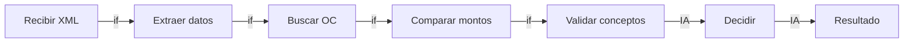

# Flujo — Validación de facturas

## Clasificación de pasos

| # | Paso | Clasificación | Justificación |
|---|---|---|---|
| 1 | Recibir XML/PDF de factura | `if` | Solo parseo de formato |
| 2 | Extraer datos fiscales | `if` | Campos fijos en CFDI |
| 3 | Buscar OC correspondiente | `if` | Match por número de referencia |
| 4 | Comparar montos factura vs OC | `if` → era IA | Tolerancia ±3% es un `if`, no criterio |
| 5 | Validar conceptos factura vs OC | **IA** | Sinónimos, abreviaciones, descripciones libres |
| 6 | Decidir: aprobar / rechazar / escalar | **IA** | Combina reglas + juicio en casos ambiguos |

## Aritmética del recorte

- Original: 6 pasos "IA" → 0.95⁶ = 73.5%
- Recortado: 4 eran `if` disfrazados → 2 pasos IA reales → 0.95² = **90.3%**

